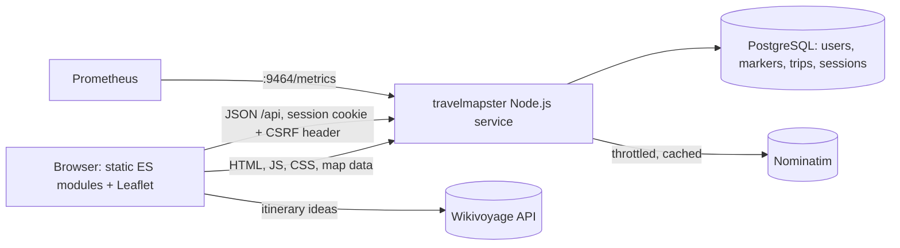

# Architecture Overview And ADR Index

## System At A Glance



One Express 5 process serves both the static frontend in `public/` and the JSON API under
`/api`. There is no frontend build step: the browser loads native ES modules. State lives in
PostgreSQL, including sessions, so any replica can serve any request.

## Backend

| Module | Responsibility |
|---|---|
| `src/server.js` | Startup: config, migrations with retry, HTTP and metrics servers, graceful shutdown |
| `src/app.js` | Express wiring: probes, logging, metrics, security headers, static files, sessions, rate limits, CSRF, routers, error handling |
| `src/config.js` | Validated configuration from environment variables ([reference](development.md#configuration)) |
| `src/routes/` | `auth`, `markers`, `trips`, `profile` (incl. public maps) and `geocode` routers |
| `src/validation.js` | Every request-body rule and limit |
| `src/rate-limit-store.js` | Rate-limit counters in PostgreSQL, shared by every replica |
| `src/repositories.js` | SQL access, always scoped to the signed-in user |
| `src/services/geocoder.js` | Nominatim client with throttling, timeout and LRU cache |
| `src/db/` | Connection pool, transactions and [migrations](data-model.md#migrations) |
| `src/middleware/csrf.js` | Synchronizer-token CSRF protection |

## API

JSON under `/api`; errors are `{ "error": "…" }` with a matching status. All routes except
`csrf-token`, `auth` and `public` need a session, and writes need the CSRF header
([security](security.md#request-protection)). Field rules are in the [data model](data-model.md#tables).

| Method | Path | Purpose |
|---|---|---|
| GET | `/api/csrf-token` | CSRF token for the current session |
| POST | `/api/auth/register`, `/api/auth/login`, `/api/auth/logout` | Account and session; responses include a fresh CSRF token |
| GET | `/api/auth/me` | Current user, or 401 |
| POST | `/api/auth/password` | Change password (`currentPassword`, `newPassword`); signs out other sessions |
| DELETE | `/api/auth/account` | Delete the account and all its data (`password`); signs out everywhere |
| GET, POST | `/api/markers` | List or create saved places |
| POST | `/api/markers/import` | Import up to 1,000 places |
| PATCH, DELETE | `/api/markers/:id` | Update or remove a place |
| GET, POST | `/api/trips` | List or create itineraries |
| PUT, DELETE | `/api/trips/:id` | Replace or remove an itinerary |
| PATCH | `/api/profile` | Set `profileVisibility` to `private` or `public` |
| GET | `/api/public/:username` | Read-only public map without notes or photo links |
| GET | `/api/geocode?q=&kind=city\|country&limit=` | World place search (1–10 results) |

## Frontend

| Module | Responsibility |
|---|---|
| `public/js/app.js` | App shell: auth, map cards, search, tabs, public view |
| `public/js/map.js` | Leaflet map: countries, labels, cities and pins |
| `public/js/geo.js` | Country index, city search, stats, ranks and badges (pure, unit tested) |
| `public/js/places.js`, `io.js` | Places tab, import and export |
| `public/js/trips.js`, `ideas.js` | Trip planner and Wikivoyage ideas |
| `public/js/passport.js` | Passport tab |
| `public/js/api.js`, `ui.js`, `confetti.js` | API client with CSRF handling, DOM helpers, celebration |
| `public/styles.css` | Design tokens and components for light and dark themes |

## Key Flows

### Authenticated request

1. The browser fetches `/api/csrf-token` once and sends it as `X-CSRF-Token` on writes.
2. Express applies the API rate limit, then CSRF validation for unsafe methods.
3. Passport restores the user from the PostgreSQL session; `requireAuth` rejects anonymous calls.
4. `validation.js` checks the body; repositories scope every query to the user.
5. `pino-http` logs the request and Prometheus records its duration by route pattern.

### Place search

Built-in countries and cities are searched in the browser. For other towns the browser calls
`/api/geocode`, which proxies Nominatim with an identifying User-Agent, at most one request per
interval across all replicas (a slot booked in PostgreSQL) and a per-process cache
([ADR 0005](adr/0005-bundled-map-data.md)).

### Delivery

GitLab CI tests and packages every branch. On `main`, a confirmed release publishes the image,
commits and tags the version, and Argo CD rolls it out; see the
[delivery flow](deployment.md#delivery-flow).

## ADR Process

Add an ADR when a change alters runtime boundaries, data ownership or retention,
authentication or secret flow, external dependencies, or delivery ownership. Use the next
number (`NNNN-short-title.md`) and the template below. Statuses: **Proposed**, **Accepted**,
**Superseded** (linked to its replacement).

```markdown
# ADR NNNN: Title

- Status: Proposed | Accepted | Superseded
- Date: YYYY-MM-DD

## Context
## Decision
## Consequences
```

## Accepted ADRs

- [ADR 0001: Keep the README short and detail in `docs/`](adr/0001-documentation-structure.md)
- [ADR 0002: One Node.js service serves the API and a build-free frontend](adr/0002-single-service-build-free-frontend.md)
- [ADR 0003: Local accounts with server-side sessions and CSRF tokens](adr/0003-sessions-and-csrf.md)
- [ADR 0004: PostgreSQL with in-app SQL migrations](adr/0004-postgres-and-migrations.md)
- [ADR 0005: Bundle map data and proxy geocoding](adr/0005-bundled-map-data.md)
- [ADR 0006: Deliver through GitLab CI and Argo CD with explicit release jobs](adr/0006-gitlab-argocd-delivery.md)
