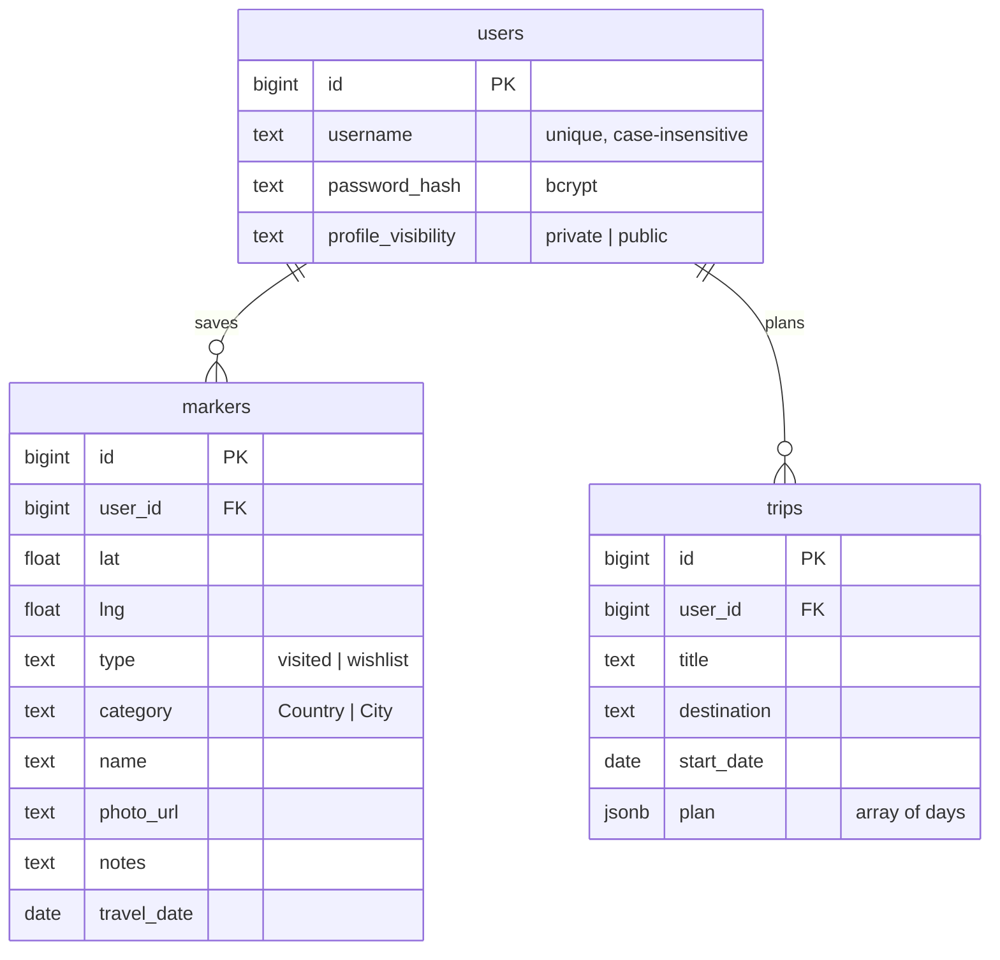

# Data Model

PostgreSQL holds all user data. The schema lives in `src/db/migrations/`; field limits are
enforced both there and in `src/validation.js`.

## Relationships

## Tables

| Table | Contents and rules |
|---|---|
| `users` | `username` is 3–32 of `A-Z a-z 0-9 _ . -`, unique regardless of case. Passwords are 8–72 bytes and stored only as bcrypt hashes (cost 12). `profile_visibility` defaults to `private`. |
| `markers` | A saved place ("marker" in the API). `name` 1–200 characters, `notes` up to 2,000, `photo_url` an HTTP(S) URL up to 2,048, `travel_date` a real calendar date. Coordinates are range-checked. |
| `trips` | `title` 1–120 and `destination` 1–160 characters, optional `start_date`. `plan` is a JSON array of 1–30 days, each with `morning`, `afternoon` and `evening` text of up to 500 characters. |
| `sessions` | Server-side sessions for `connect-pg-simple`; expired rows are pruned every 15 minutes. |
| `rate_limits` | Unlogged rate-limit counters per limiter and client IP, shared by replicas; expired rows are swept every 10 minutes. |
| `geocoder_throttle` | One row with the earliest start time of the next Nominatim request. |
| `schema_migrations` | Applied migration versions. |

All timestamps are `created_at`/`updated_at` (`timestamptz`). Deleting a user cascades to their
markers and trips.

## Migrations

Files named `NNN_description.sql` run in order at startup, each in its own transaction, under a
PostgreSQL advisory lock so replicas never race. `npm run migrate` applies them without starting
the server. Migrations are forward-only: add a new file, never edit an applied one, and keep
changes compatible with the previous release while both may run during a rollout.

## Map Data

`public/data/` holds read-only reference data built by `scripts/build-map-data.js` from
[Natural Earth](https://www.naturalearthdata.com) (public domain) and
[GeoNames](https://www.geonames.org) `cities500` (CC BY 4.0, credited on the map):

| File | Contents |
|---|---|
| `countries.geojson` | 1:50m country borders simplified to 0.02°, with name, aliases, continent, population and label placement |
| `cities.json` | The base list loaded with the page: about 4,900 places shown by zoom 6, as objects with name, country, capital flag, population, `minZoom` and coordinates |
| `cities/index.json`, `cities/<tile>.json` | About 220,000 smaller places in region tiles of up to 4,000, as rows `[name, countryId, capital, population, minZoom, lat, lng]` |

Every GeoNames place of 500+ people is included, except city districts, historical and
abandoned places. `minZoom` is the first half zoom step at which the place's dot and name fit
beside the places shown before it, ranked by capitals, Natural Earth's curated label zooms and
population; places that never fit get `11.5` and show as dots at the deepest zoom.

To rebuild, see [development](development.md#rebuilding-map-data).

## Import And Export

Export and import use the marker fields `id, lat, lng, type, name, category, photoUrl, notes,
travelDate` as JSON or CSV. The Places tab drops rows that duplicate an existing place, then
`POST /api/markers/import` stores up to 1,000 places in one transaction and reports the
invalid rows it skipped.

## Privacy

Data is private to its owner. A public profile exposes username, coordinates, type, name,
category and travel date of each place, never notes or photo links
([security](security.md#privacy)). Deleting an account removes the user, their places, trips and
sessions at once.
